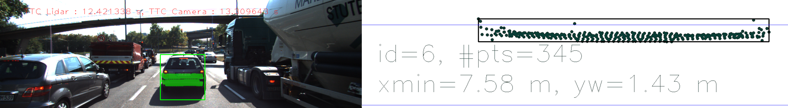
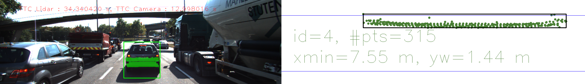
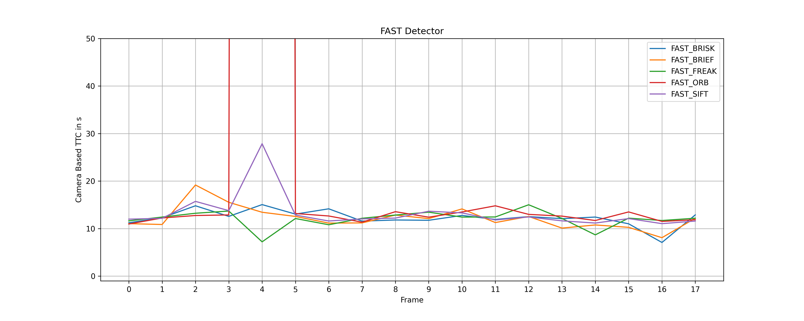
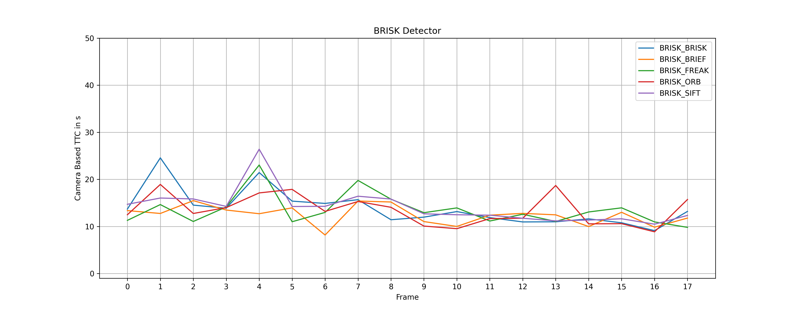
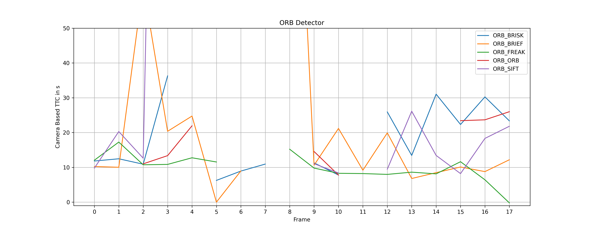
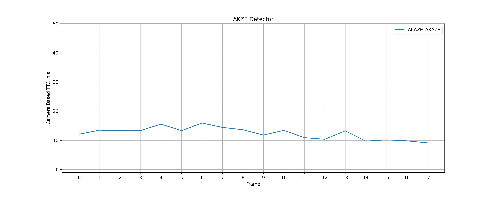
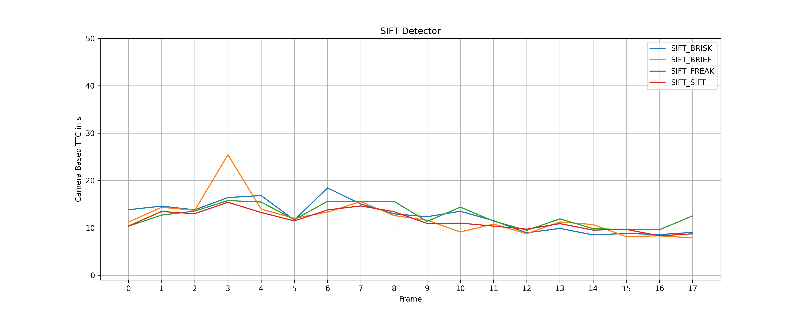
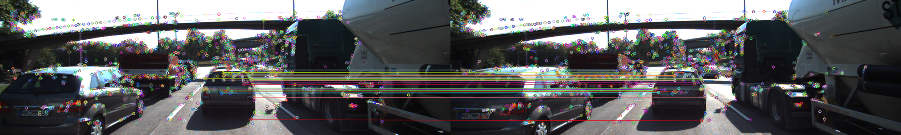
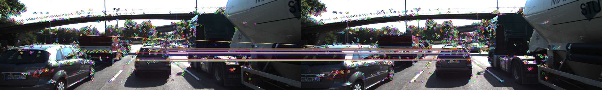

# SFND 3D Object Tracking

This project is the extension of 2D tracking to associate keypoints in image plane with lidar clouds points 3D plane.  


## FP.1 Match 3D Objects
Implement the method "matchBoundingBoxes", which takes as input both the previous and the current data frames and provides as output the ids of the matched regions of interest (i.e. the boxID property). Matches must be the ones with the highest number of keypoint correspondences.

The intuition is to find which bounding box in the prev frame machtes the best of the current frame. 
The bouding boxes which contain the most paried keypoints are matched bouding boxes
* Part1: Find all matched bounding boxes, save the bounding boxes ids into a mutimap container.
    * step1: Iteration of the matches, query the keypoints in prev frame and keypoints in  current frame
    * Step2: Iteration of the bounding boxes find bounding box contains keypoint from previous and current frame respectively
    * Step3: Push the boxID from previous frame and boxID from current  frame if they contain  the matched points

* Part 2: Iterates all boxes ID from previous frame in the pairedBoxes. Then counting the number of paired boxesID from current frame,  the most frequntly matched boxID from current box is the best matched box for previous box.

    * Step1: Put the matched previous BoxID into a set container to eliminate the redundant IDs, iterate the set container
    * Step2: Iterate the matched current BoxIDs, count the frequncy of each BoxIDs. This has been done by put BoxID into a map container.
    * Step3: Sort the  map  container in descent order, the first one is the best matched box from current frame to previous bounding box, retrive all the keys.

```c++   
    
void matchBoundingBoxes(std::vector<cv::DMatch> &matches, std::map<int, int> &bbBestMatches, DataFrame &prevFrame, DataFrame &currFrame)
{
    multimap<int, int> pairedBoxes; // list of parired {currBoxId: prevBoxId}, allows redudent keys
    for(auto match:matches){
        cv::KeyPoint prevPoint = prevFrame.keypoints[match.queryIdx];
        cv::KeyPoint currPoint = currFrame.keypoints[match.trainIdx];
        int prevBoxId = -1;
        int currBoxId = -1;
        for(auto box:prevFrame.boundingBoxes){
            if(box.roi.contains(prevPoint.pt)){
                prevBoxId = box.boxID;
            }
        }
        for(auto box:currFrame.boundingBoxes){
            if(box.roi.contains(currPoint.pt)){
                currBoxId = box.boxID;
            }
        }
        // only save the paired boxID if the bounding box contains the paired keypoints both the previous frame and current frame.

        if(prevBoxId != -1 && currBoxId!= -1){
            pairedBoxes.insert({currBoxId, prevBoxId});
        }
    }
    set<int> boxKeys;
    for(auto& it : pairedBoxes){
        boxKeys.insert(it.first);
    }
    //
    for(const int &boxKey: boxKeys){
        auto pairedBox = pairedBoxes.equal_range(boxKey);
        map<int,int> currPairedCount;
        for (auto it = pairedBox.first; it != pairedBox.second; ++it) {
            currPairedCount[(*it).second]++;
        }

        // sort the hash map in the descent order,  the first one is best matched bouding box position
        vector<pair<int,int> > vecPairedCount(currPairedCount.begin(),currPairedCount.end());
        sort(vecPairedCount.begin(), vecPairedCount.end(),[](pair<int,int> a, pair<int,int> b){ return a.second > b.second;}); 
        bbBestMatches.insert({vecPairedCount.begin()->first,boxKey});
        //cout<<"previous frame bboxid: "<< vecPairedCount.begin()->first<<" current frame bbox id: "<<boxKey<<endl;
    }
}
```


## FP.2 Compute Lidar-based TTC

Compute the time-to-collision in second for all matched 3D objects using only Lidar measurements from the matched bounding boxes between current and previous frame.

X direction is the ego vehicle driving diretion, therefore the outlier in y dirction can be filtered 
based on emperical lane width 4 meter; 
points in x diirection can be filtered  based  on its  distribution. Outliers can be defined as
the points which outside the firt and third quartile. Inspired by https://towardsdatascience.com/understanding-boxplots-5e2df7bcbd51

<p align="center">


 
 </p>

Step1:Filter points not into the same lane with ego vehicle,
Put the previous points and current points in x direction respectively.
Step2: Find the mean and standard deviation of previous points and current points.
Step3: filter all the outside teh first quartile and third quartile of the distribution
Step4: Caculate the mean value of the filtered points, then caculate the  TTC = d1 * delta(t) / (d0 - d1)
  
```c++
void computeTTCLidar(std::vector<LidarPoint> &lidarPointsPrev,
                     std::vector<LidarPoint> &lidarPointsCurr, double frameRate, double &TTC)
{
    int lane = 4;
    vector<double> prevPointX;
    for(auto it : lidarPointsPrev){
        if(abs(it.y) < lane/2) prevPointX.push_back(it.x);
    }
    vector<double> currPointX;
    for(auto it : lidarPointsCurr){
        if(abs(it.y) < lane/2) currPointX.push_back(it.x);
    }
    //based on the six sigma to filter the outlier of x
    //calcualte the mean of lidar  point in x

    removeOutlier(prevPointX);
    removeOutlier(currPointX);

    double d0 = 1e9;
    double d1 = 1e9;
    for (auto it: prevPointX)
    {
        d0 = d0 > it ? it : d0;
    }

    for (auto it: currPointX)
    {
        d1 = d1 > it ? it : d1;
    }
    
    // TTC = d1 * delta(t) / (d0 - d1)
    TTC = d1/(frameRate*(d0-d1));
}
```

### Remove Outliers Function
```c++

void removeOutlier(vector<double> & vect){
    double vectMean = accumulate(vect.begin(), vect.end(),0.0) / vect.size();
    double vectResidual = 0.0;
    for(auto it : vect){
        vectResidual += (it - vectMean) * (it - vectMean); 
    }
    double vectStd = sqrt(vectResidual / (vect.size()-1));
    vector<double> tempVect;
    const double upperFactor = 2.698;
    for(auto it:vect){
        if(abs(it-vectMean) < upperFactor * vectStd){
            tempVect.push_back(it);
        }
    }
    vect =  tempVect;
}

```


## FP.3 Associate Keypoint Correspondences with Bounding Boxes
Prepare the TTC computation based on camera measurements by associating keypoint correspondences to the bounding boxes which enclose them. All matches which satisfy this condition must be added to a vector in the respective bounding box.

There are total tow tasks need to be achieved. 
* Task1: Filter all matached keypoits which are inside the bounding boxes in the current frame.
  * S1: Iterate all the machted keypoints 
  * S2: Push the matched keypoint into the withinMatches vector when it inside the current bounding box
* Task2: Calculate the mean value of the euclidean distance of all the matched keypoints into the bounding box
* Task3: Iterate all the withinMatches, push the matched keypoints to bounding box kptMatches when the distance is less than mean euclidean value.

```c++
// associate a given bounding box with the keypoints it contains
void clusterKptMatchesWithROI(BoundingBox &boundingBox, std::vector<cv::KeyPoint> &kptsPrev, std::vector<cv::KeyPoint> &kptsCurr, std::vector<cv::DMatch> &kptMatches)
{
    // ...
    // filtering outside the bouding box
    vector<cv::DMatch> withinMatches;
    for(auto kptMatch:kptMatches){
        cv::KeyPoint currPoints =  kptsCurr[kptMatch.trainIdx];
        if(boundingBox.roi.contains(currPoints.pt)){
            withinMatches.push_back(kptMatch);
        }
    }
    // calculate the distance
    double meanDistance = 0;
    for(auto match:withinMatches){
        meanDistance += match.distance;
    }

    if(withinMatches.size() !=0 ){
        meanDistance = meanDistance / withinMatches.size();
    }
    // only the paired keypoints with distance less than the mean distance will be kept.
    for(auto match:withinMatches){
        if(match.distance < meanDistance){
            boundingBox.kptMatches.push_back(match);
        }
    }

    
}
 ```
 
## FP.4 Compute Camera-based TTC

Compute the time-to-collision in second for all matched 3D objects using only keypoint correspondences from the matched bounding boxes between current and previous frame.

The camera based TTC has assumed the constant velocity difference between ego car and preceding car. Based on the geometry, the TTC can be caculated via the formular: TTC = -dT / (1 - medDistRatio), where dT is the frame time, medDistRation is the median of the ration of the euclidean distance from the paired keypoints. Specifically, the implementation has been done with the following steps:

* Calculate ratio of all the combination of paired keypoints, if the euclidean distance great than definde minDist = 100, it will treat as a valid ratio and put into a vector container distRatios.
    * S1: Iterate the matched keypoits in a for loop from firt position to previous position of last position, fetch each paired keypoints 
    * S2: Iterate the matched keypoints in a for loop from next potion of S1 selected keypoints to latt position of the matched points.
    * S3: calculate the euclidean distance of the keypoints into the same frame, then caculate the ration of the distance between previous frame and current frame.
    * S4: Save the ratio when the current distance is great than defiend minDist and prevDist in not zero.
* Outlier elinimation: to eliminate the outliers, here use the first and third quatiles to define the minimum and maximum points. The implementation use the same function which has been posted on FP.2:  void removeOutlier(vector<double> & vect).

```c++

// Compute time-to-collision (TTC) based on keypoint correspondences in successive images
void computeTTCCamera(std::vector<cv::KeyPoint> &kptsPrev, std::vector<cv::KeyPoint> &kptsCurr, 
                      std::vector<cv::DMatch> kptMatches, double frameRate, double &TTC, cv::Mat *visImg)
{
    // ...
    vector<double> distRatios;
    for(auto it1=kptMatches.begin(); it1!=kptMatches.end()-1; it1++){
        double minDist = 100.0;
        cv::KeyPoint kpOuterPrev = kptsPrev.at(it1->queryIdx);
        cv::KeyPoint kpOuterCurr = kptsCurr.at(it1->trainIdx);
        for(auto it2=kptMatches.begin()+1; it2!=kptMatches.end(); it2++){
            cv::KeyPoint kpInnerPrev = kptsPrev.at(it2->queryIdx);
            cv::KeyPoint kpInnerCurr = kptsCurr.at(it2->trainIdx);
            double prevDist = cv::norm(kpOuterPrev.pt - kpInnerPrev.pt);
            double currDist = cv::norm(kpOuterCurr.pt - kpInnerCurr.pt );
            if(prevDist > std::numeric_limits<double>::epsilon() && currDist >= minDist){
                double distRatio = currDist / prevDist;
                distRatios.push_back(distRatio);
            }
        }
    }
    sort(distRatios.begin(), distRatios.end());
    // filter the distRatios
    // calculate the mean, std
    removeOutlier(distRatios);
    long medianIndex = floor(distRatios.size()/2);
    double medDistRatio = distRatios.size() % 2 == 0 ? (distRatios[medianIndex] + distRatios[medianIndex + 1])/2 : distRatios[medianIndex];

    double dT = 1 / frameRate;
    TTC = -dT / (1 - medDistRatio);
}

```
## FP.5 Performance Evaluation 1
Find examples where the TTC estimate of the Lidar sensor does not seem plausible. Describe your observations and provide a sound argumentation why you think this happened.
 
 The  following measuremnts inllustrate the lidar TTC results for the 18 frames. In addition, we also present the camera TTC result  with dector Shi-Thomasi and descriptor BRISK for comparison. 

| Frame ID    | Xmin (m) |   yw(m)     | Lidar TTC(s)   |  Camera TTC(s) |  
| ------------| ---------|-------------|-------------   | ---------------|
|       1     |    7.931 |   1.456     |   12.9722      |      13.9352   |  
|       2     |    7.849 |   1.459     |   12.264       |      12.0402   |   
|       3     |    7.793 |   1.466     |   13.9161      |      13.877    | 
|       4     |    7.685 |   1.446     |   14.8865      |      12.398    |   
|       5     |    7.638 |   1.442     |   7.41552      |      13.6889   |   
|       6     |    7.577 |   1.433     |   12.4213      |      13.7648   |   
|       7     |    7.555 |   1.438     | **34.3404**    |      12.1823   |   
|       8     |    7.475 |   1.452     |   9.34376      |      12.9428   | 
|       9     |   7.434  |   1.406     | **18.1318**    |      11.0729   |   
|       10    |   7.393  |   1.411     | **18.0318**    |      13.8934   |   
|       11    |   7.205  |   1.455     |   14.9877      |      12.7942   |    
|       12    |   7.272  |   1.47      |   10.1         |      11.8227   |   
|       13    |   7.194  |   1.458     |   9.22307      |      12.1304   | 
|       14    |   7.129  |   1.384     |   10.9678      |      11.1774   |   
|       15    |   7.042  |   1.381     |   8.09422      |      8.60163   |   
|       16    |   6.827  |   1.362     |   8.81392      |      10.1665   |   
|       17    |   6.896  |   1.377     |   10.2926      |      11.7562   |   
|       18    |   6.814  |   1.388     |   8.30978      |      8.06211   | 
  
 
 From Xmin measurements we could simply assume the distance between ego vehicle and preceding vehicle is getting  closer with the increasing of frame. In general we could see the trend of Lidar TTC and Camera  TTC is descending. However, in the frame 7,9,10 we could obviouly see the Lidar TTC are abnormal from the trend. Especialy the Lidar TTC measurement in frame 7 which is almost third times than other measurements. The reason for this implausible measurement in frame 7 is because of its different point clouds distribution on preceding car. Below we could see the frame 6 has serveral points on the  trailer parts  which  have not been presented on frame  7. This results in distance (d1) from frame 7 is bigger than the real distace between car  tailer parts. As  consider the TTC = d1 * delta(t)/(d0-d1), the value d0 - d1 is smaller,  which leads to the higher value of TTC in frame 7. 

**Frame 6**
 <p align="center">


 
 </p>

**Frame 7**
 <p align="center">


 
 </p>

 
## FP.6 Performance Evaluation 2

Run several detector / descriptor combinations and look at the differences in TTC estimation. Find out which methods perform best and also include several examples where camera-based TTC estimation is way off. As with Lidar, describe your observations again and also look into potential reasons.

The TTC results have been illustrate in the following plots with different combination of detectors and descrptor. During the experiments, the FLANN and KNN neighbors matching methods have been applied. 

**FAST as Detector**


**HARRIS as Detector**


**BRISK as Detector**


**ORB as Detector**


**FAST as Detector**


**AKAZE as Detector**


 **SIFT as Detector**
 


Obviously, the Harris detector has very bad performance because of less keypoints in the preceding vehlicle has been detected which results in less matched keypoints between previous frame and current frame. Therefore, some TTCs from this approch are invalid. Furthermore, the fluctuation of the TTCs is very high. Another implausible result is that, several combinations at frame 5 and 6 have high increased values, especially FAST detector with ORB descriptor, it has 2737 s TTC calculated which is definitely  wrong value. The reseson in behind could be from camera based assumpton based on the constant velocity. In the transition between frame 4 and 5 should have high accelaration change of the preceding car. Another reason  could be caused by the miss mathced keypoints. In frame 4 we could see all the current keypoints in the bounding box are relative good mapped into the previous frame, except one outlier on the groud, but still this point will be filtered before TTC calculation. However, in the frame 5 we coud see obviouly two points are mis matched. In addition, the x direction of thoes points still in the boxplot range. This need to bee futher improved in the codes either in y direction with filter or filter the matched keypoints also into the boulding boxes. 


 **Frame 4**
 

 **Frame 5**
 

The metrics to  select the best combination of detector and descriptor based on consistency and accuracy. In  Comparison  with Lidar TTC measurement and the consistency of the measurements in 18 frame,  the recomendation is as follows:

* **Brisk** detector & **BRIEF** descriptor has similar measurmens as Lidar TTC and the most reliable performance.
* **SIFT** detector & **BRISK** descriptor  and  **FAST** detector & **BRISK** descriptor both have similar measurmens as Lidar TTC and reliable performance.
